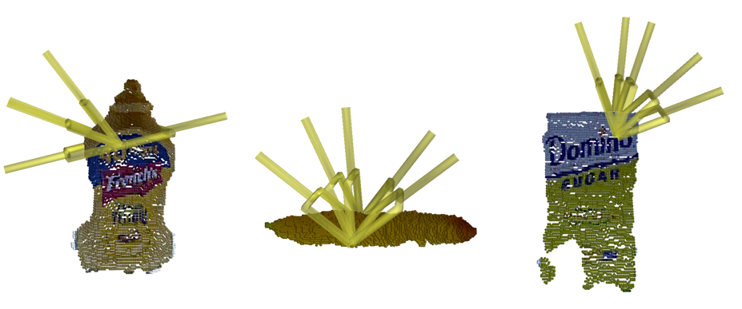

# Package for Edge Grasp Network: A Graph-Based SE(3)-invariant Approach to Grasp Detection

[Project Website](https://haojhuang.github.io/edge_grasp_page/)&nbsp;&nbsp;•&nbsp;&nbsp;[PDF](https://arxiv.org/abs/2211.00191)&nbsp;&nbsp;•&nbsp;&nbsp; [Poster](https://drive.google.com/file/d/1Y5Myg-XBXbj9IkZjGn7QAt5z5Rf6ZoVd/view)&nbsp;&nbsp;•&nbsp;&nbsp; **ICRA 2023**

<p align="center">
  
</p>

(a) Generalize to various objects sets : 92% grasp success rate in cluttered objects.<br>
(b) Enable a good control on the generated grasp poses (e.g., generate graps with the same specific contact location, as shown in the figure above).<br>
(c) Real time detection: more than 2000 grasps/15 ms with a common GPU.<br>

Please check for our paper for more details.

## Installation
**Step 1.** Recommended: install `conda` with (Note: if you want to visualize the graps with mayavi, you need to get Python 3.7 installed since vtk doesn't support 3.8+ based on my knowledge)

```shell
conda create -n edge_grasp (python=3.7)
conda activate edge_grasp
```
Install mayavi (you can skip thi step if you don't need to visulize the generated grasps, we will provide the visulization code for grasps later)

```shell
pip install opencv-python pillow scipy matplotlib
conda install mayavi -c conda-forge
```

**Step 2.** Install [Pytorch](https://pytorch.org/get-started/locally/)

**Step 3.** Install [PyG](https://pytorch-geometric.readthedocs.io/en/latest/notes/installation.html). Recommend to install from [wheels](https://data.pyg.org/whl/)

**Step 4.** Install other required packages (some packages are not listed here, but they should be easy to install with `pip`)

```shell
pip install open3d
pip install pybullet==2.7.9
```

## Getting Started
**Step 1.** Download the 3.4-Million grasp dataset from [the Google drive](https://drive.google.com/file/d/1ZA15hQ41mzMXShfkzKufF4pYTDjZgJWD/view?usp=share_link) or Generate your own training and validation dataset with the following scripts.

```shell
python clutter_grasp_data_generator.py --scene packed --object-set packed/train --sample_number 32
python clutter_grasp_data_generator.py --scene pile --object-set pile/train --sample_number 32
```

**Step 2.** Train a model:

Note that if you are using the 3.4-Million grasps dataset, it will take more than 10 minutes at the first time to preprocess the data and store it in the drive for reuse. Also, it needs at least 12GB free space to store the dataset in your drive.

To train a traditional PointNet++-based Model:
```shell
python train.py --train --verbose
```

To train a Vector-Neuron PointNet++-based Model:
```shell
python train.py --train --verbose --vn
```

To plot the validation loss curve and accuracy:
```shell
python plot_test_loss_and_accuracy.py
```

Please refer to the [PointNet++](https://arxiv.org/abs/1706.02413) paper and the [Vector Neuron](https://arxiv.org/abs/2104.12229) paper if you like to have more background.

**Step 3.** To test on simulated grasping with pretrained parameters (We provided the pretrained parameters in the folds of `edge_grasp_net_pretrained_para` and `vn_edge_pretrained_para`)

```shell
python test_clutter_grasp.py (--vn for the vector neuron version)
```
## Description
Edge-Grasp-Net converges within 200 epochs while takes a shorter time for each step; VN-Edge-Grasp-Net converges within 100 epochs. Please read our paper for more details if needed.


## Future Updates:
- Instruction that you can make a change for your own gripper (we used panda gripper in simulation): coming soon
- Visualization Function to look at the grasps
- Grasp filtering example.py (to select the grasp contact location, approach direction and etc. **before** feeding them to the model)
- ROS package that takes the input as the raw point cloud and output the scored grasps


